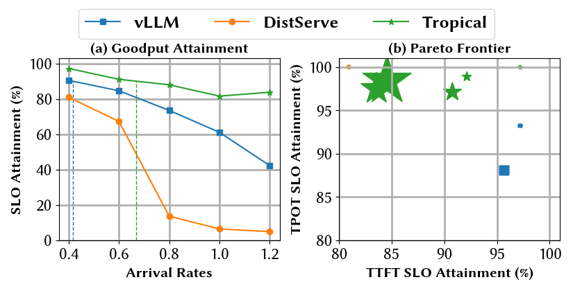

## 系统框图


## 安装方法

```bash
# VLLM 版本：v0.5.3 (5689e256baf0c45148a01ad147abf11ad82c9690)
cd /path/to/vllm
git checkout 5689e256baf0c
# 安装 sgir-distserve
cd /path/to/sgir-distserve
pip install -v -e .
```

## 使用方法

### Server

sgir-distserve 的使用方法和 vllm 基本一致，在一下几个字段有所不同：

- `--replica-spec`: 并行方式，例： `--replica-spec 2,1 2,1`，表示创建 2 个 engine，每个 engine 的 tp 为 2，pp 为 1。当前仅支持 pp 为 1 的情况。
- `--partition-id`：分组方式，[0, partition_id) 为 prefill 实例。[partition_id, num_replica) 为 decode 实例。
- `--prefill-max-num-seqs`: prefill 最大 batch seqs 数量，decode 同理。
- `--decode-max-num-seqs`: 如上所述。
- `--prefill-max-num-batched-tokens`: 最大 batched tokens 数量，decode 同理。
- `--decode-max-num-batched-tokens`: 如上所述。
- `--prefill-gpu-memory-utilization`: GPU 使用量，decode 同理。
- `decode-gpu-memory-utilization`: 如上所述

下面是一个 server 启动脚本的例子：

```bash
ray start --head # 在 A100 Server 上启动 ray，用于实例的分配和管理
python -m sgir_distserve.entrypoints.openai.api_server \
--model NousResearch/Meta-Llama-3-8B-Instruct  \
--port 8012 --mode distserve \
--replica-spec 2,1 2,1 2,1 --partition-id 1 # 申请 3 个 engine，1 个为 prefill，2 个为 decode \
--prefill-max-num-seqs 256 --prefill-max-num-batched-tokens 8192 \
--prefill-gpu-memory-utilization 0.8 \
--decode-max-num-seqs 64 --decode-max-num-batched-tokens 8192 \
--decode-gpu-memory-utilization 0.8 \
--enable-chunked-prefill
```

## Client

Client 兼容 Openai API Server。支持 `v1/completions` 和 `v1/chat/completions`。

```python
import requests
ans = requests.post("http://127.0.0.1:8012/v1/completions", json={"model": "NousResearch/Meta-Llama-3-8B-Instruct", "prompt": "San Francisco is a city that"})
ans.json()
# >>> {'id': 'cmpl-89b6388bdef04d0e9b0b45e271e3bce6', 'object': 'text_completion', 'created': 1729153111, 'model': 'NousResearch/Meta-Llama-3-8B-Instruct', 'choices': [{'index': 0, 'text': ' has something for everyone. From its iconic Golden Gate Bridge to its vibrant cultural attractions', 'logprobs': None, 'finish_reason': 'length', 'stop_reason': None}], 'usage': {'prompt_tokens': 7, 'total_tokens': 23, 'completion_tokens': 16}}
```

## Experiment result

我们基于LongBench和Mooncake数据集，测试了vllm，Tropical和DistServe的TTFT，TPOT，JCT等性能指标，以量化分析Tropical的优化。

### LongBench性能分析

| Model            | Dataset    | SKU            | #workers | (TP, PP) |
|------------------|------------|----------------|----------|----------|
| Internlm2_5-20b-chat | LongBench  | A100-SXM4-80GB | 2        | (2,1)    |

#### SLO Attainment



#### End-to-End Latency


#### CDF


#### Queueing Latency


### Mooncake性能分析

| Model            | Dataset    | SKU            | #workers | (TP, PP) |
|------------------|------------|----------------|----------|----------|
| Internlm2_5-20b-chat | Mooncake  | A100-SXM4-80GB | 2        | (2,1)    |

#### SLO Attainment


#### End-to-End Latency


#### CDF


#### Queueing Latency


## Algorithm
