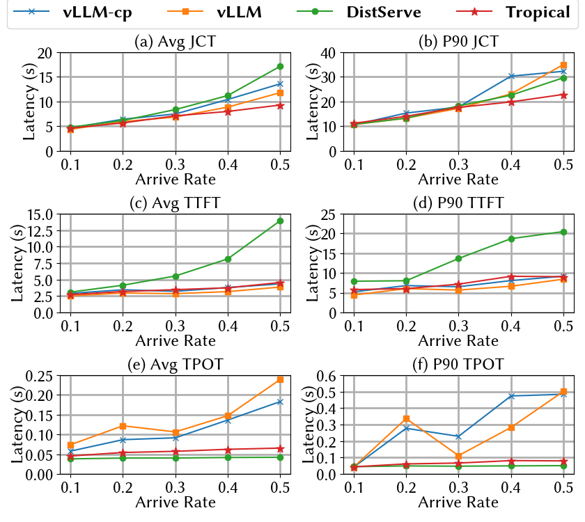

## System Overview


Our system is primarily divided into three parts: Prefill Engines (Prefill Workers in Tropical), Decode Engines (Multiplexing Workers in Tropical), and Engine IPC Client (Multiplexing Toggle in Tropical).

All Engines can perform both Prefill and decode operations, depending on the scheduling strategy of the IPC Client. This means that Prefill and Decode Engines can switch roles on the fly. In particular, Decode Engines can take on Prefill operations. We found that through SLO-Aware Multiplexing, we can significantly reduce Prefill queuing time without changing the Decode role (swap, migration, or flushing computation KVCache). SLO-Aware Multiplexing intelligently selects whether to route Prefill requests to Prefill Engines or Decode Engines.

To ensure the scalability of the system, we use a decentralized scheduling approach, meaning all Engines operate asynchronously. We found that using Python coroutines for Engine event management incurs significant overhead, so Engines and IPC Client use ZeroMQ for inter-process communication. IPC is used for control flow communication in KVCache transfer and monitoring the status of Engines (queuing situation, memory usage, execution time of the current batch). In practice, when the number of Workers is relatively small (4 workers in Tropical), the scheduling overhead is negligible.

Tropical's allocation of instances is relatively flexible, allowing all Engines to use independent parallelism configurations.


## Installation

```bash
# VLLM Version: v0.5.3 (5689e256baf0c45148a01ad147abf11ad82c9690)
cd /path/to/vllm
git checkout 5689e256baf0c
# Install sgir-distserve
cd /path/to/sgir-distserve
pip install -v -e .
```

## Usage

### Server

The usage of sgir-distserve is mostly consistent with vllm, with differences in the following fields:

- `--replica-spec`: Parallelism method, e.g., `--replica-spec 2,1 2,1`, indicating the creation of 2 engines, each with tp=2 and pp=1. Currently only supports cases where pp=1.
- `--partition-id`: Grouping method, [0, partition_id) for prefill instances. [partition_id, num_replica) for decode instances.
- `--prefill-max-num-seqs`: Maximum number of batch sequences for prefill, same applies to decode.
- `--decode-max-num-seqs`: As described above.
- `--prefill-max-num-batched-tokens`: Maximum number of batched tokens, same applies to decode.
- `--decode-max-num-batched-tokens`: As described above.
- `--prefill-gpu-memory-utilization`: GPU usage, same applies to decode.
- `decode-gpu-memory-utilization`: As described above.

Below is an example of a server startup script:

```bash
ray start --head # Start ray on A100 Server for instance allocation and management
python -m sgir_distserve.entrypoints.openai.api_server \
--model NousResearch/Meta-Llama-3-8B-Instruct  \
--port 8012 --mode distserve \
--replica-spec 2,1 2,1 2,1 --partition-id 1 # Request 3 engines, 1 for prefill, 2 for decode \
--prefill-max-num-seqs 256 --prefill-max-num-batched-tokens 8192 \
--prefill-gpu-memory-utilization 0.8 \
--decode-max-num-seqs 64 --decode-max-num-batched-tokens 8192 \
--decode-gpu-memory-utilization 0.8 \
--enable-chunked-prefill

## Client

Client is compatible with Openai API Server. It supports `v1/completions` and `v1/chat/completions`.


```python
import requests
ans = requests.post("http://127.0.0.1:8012/v1/completions", json={"model": "NousResearch/Meta-Llama-3-8B-Instruct", "prompt": "San Francisco is a city that"})
ans.json()
# >>> {'id': 'cmpl-89b6388bdef04d0e9b0b45e271e3bce6', 'object': 'text_completion', 'created': 1729153111, 'model': 'NousResearch/Meta-Llama-3-8B-Instruct', 'choices': [{'index': 0, 'text': ' has something for everyone. From its iconic Golden Gate Bridge to its vibrant cultural attractions', 'logprobs': None, 'finish_reason': 'length', 'stop_reason': None}], 'usage': {'prompt_tokens': 7, 'total_tokens': 23, 'completion_tokens': 16}}
```

## Experiment Result

We conducted performance tests on vllm, Tropical, and DistServe using the LongBench and Mooncake datasets. We measured performance metrics such as TTFT (Time to First Token), TPOT (Time Per Output Token), and JCT (Job Completion Time) to quantitatively analyze the optimizations in Tropical.

### Performance Comparison

| Model                | Dataset    | SKU               | #workers | (TP, PP) | TTFT SLO | TPOT SLO |
|----------------------|------------|-------------------|----------|----------|----------|----------|
| Internlm2_5-20b-chat |  Mooncake  | A100-SXM4-80GB    | 2        | (2,1)    |    5x    |   100ms  |

#### SLO Attainment


#### End-to-End Latency


#### CDF


#### Queueing Latency


| Model                | Dataset    | SKU               | #workers | (TP, PP) | TTFT SLO | TPOT SLO |
|----------------------|------------|-------------------|----------|----------|----------|----------|
|    Llama-2-70b-hf    |  Longbench  | A100-SXM4-80GB   | 2        | (4,1)    |    5x    |   100ms  |

#### SLO Attainment


#### End-to-End Latency


#### CDF


#### Queueing Latency


| Model                | Dataset    | SKU               | #workers | (TP, PP) | TTFT SLO | TPOT SLO |
|----------------------|------------|-------------------|----------|----------|----------|----------|
| Internlm2_5-20b-chat |  Longbench  | A100-SXM4-80GB   | 2        | (2,1)    |    5x    |   100ms  |

#### SLO Attainment


#### End-to-End Latency


#### CDF


#### Queueing Latency


